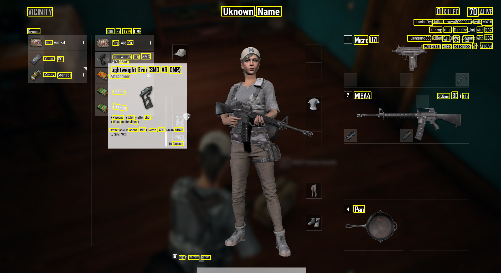
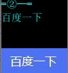
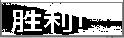

# OpenVINO AI
Intel OpenVINO AI usage

## Enviroment
* python3 **!! Use anaconda to manage python environment is strongly recommended**
* openvino 2020R1 version.
  please refer to [OpenVINO@intel windows installation](https://docs.openvinotoolkit.org/latest/_docs_install_guides_installing_openvino_windows.html)
  **!! Need to run setupvars.bat after installation**
* pip install opencv-python

### if you manage enviroment with Anaconda, here is some installation reference.
 
 

## Run app
* `python main.py -m model\text_detection\text-detection-0004.xml -i input\text_detection.png`

* `python main.py -m model\text_recognition_eng\text-recognition-0012.xml -i input\eng_recognition.png`
 
* `python main.py -m model\text_recognition_ch\text-recognition.xml -i input\ch_recognition.jpg`  

## Visualization

   
 
 

    
## Info @ OpenVINO model
| Model type | Model framework |  Model size | type
 | -- | -- | -- | -- |
 | Text detection | Pixel_link + MobileNet v2 | 16.5MB | FP32|
 | English Text recognition | LSTM+CTC Loss | 45.3MB |FP32 |
 | Chinese Text recognition | DenseNet+CTC Loss | 18.7MB |FP32 |

**trick for Chinese Text recognition model**  
The trained data of this model is a black text with white background. Therefore the same text style is needed for test data.  
But for some pictures with the irregular background, it is difficult to check whether the text is black, so two times inference is deployed in the project.

`example of the irregular background`  

## Performance @ OpenVINO model

| \fps |tensorflow model|	OpenVINO model|
 | -- | -- | -- |
|text recognition tf |	0.6|1.71|
|eng_recogtion	|14.29	|115|
|ch_recogtion|	18.53|	44.27|

